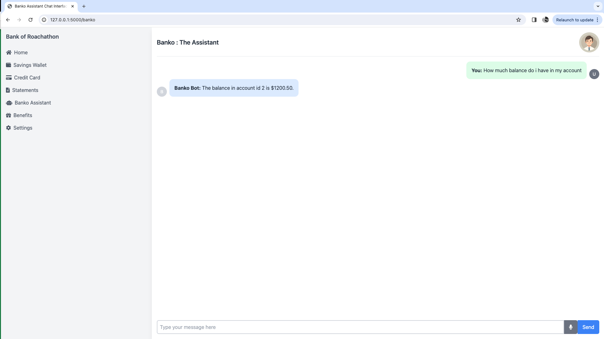

# Banko Assistant App

## Overview
The Banko Assistant App is a modern banking application designed to offer seamless and secure banking experiences to its users. Built with Python and Flask, this app leverages the powerful combination of LangChain with SQLToolkit for efficient interaction with CockroachDB, and integrates Language Model (LLM) functionalities for an enhanced user experience. Whether you're managing accounts, making transactions, or getting financial insights, the Bank of Roachathon App brings the future of banking to your fingertips.

##### Banko Assistant App /Home

##### Banko Assistant /Banko



## Features
- **BankoAssistant:** Talk to an assistant about all your banking and transaction queries. 
- **Dashboard:** All transaction information, insights and credit card information.

## Getting Started

### Prerequisites
Before you begin, ensure you have the following installed:
- Python 3.8 or later
- Flask
- An instance of CockroachDB
- LangChain and SQLToolkit

### Installation
**Clone the repository**
```bash
git clone https://github.com/david7joy/BankoAssistant.git
cd BankoAssistant
```

### Install dependencies
```bash
pip install -r requirements.txt
```

### Configure API_Key if using OpenAI or any other non local LLM
```bash
add key to config.py
```

### Run the application
```bash
flask run
```

### Usage
After launching the app, you can:

- Access the web interface at http://localhost:5000 to manage your banking needs.
- click on the `bankoassistant` on the sidebar for assistant page
- Use the REST API for programmatic access to account and transaction functionalities.
- Note : `some artificats are static - due to MVP`


Project Link: https://github.com/yourrepository/BankOfRoachathonApp